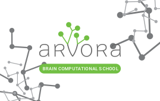

..
    # This file is part of  program Arvora
    # Copyright © 2023  Carlo Oliveira <carlo@nce.ufrj.br>,
    # `Labase <http://labase.selfip.org/>`_ - `NCE <http://portal.nce.ufrj.br>`_ - `UFRJ <https://ufrj.br/>`_.
    # SPDX-License-Identifier: `GNU General Public License v3.0 or later <http://is.gd/3Udt>`_
Arvora - Brain Computational School
=======================================
 |Arvora|

Brain Computational School

  |python| |license| |github|  |docs|

:Author:  `Carlo E. T. Oliveira`_
:Affiliation: `Universidade Federal do Rio de Janeiro`_
:License: `GNU General Public License v3 or later (GPLv3+)`_
:Homepage: `Projeto Arvora`_
:Changelog: `CHANGELOG <CHANGELOG.rst>`_

Alite
------------------

Brain Computational School

Um ambiente virtual dedicado ao ensino e pesquisa com uma interface intuitiva.

-------

Laboratório de Automação de Sistemas Educacionais
-------------------------------------------------

**Copyright © Carlo Olivera**

LABASE_ - NCE_ - UFRJ_

|LABASE|

.. _LABASE: http://labase.activufrj.nce.ufrj.br
.. _NCE: http://nce.ufrj.br
.. _GNU General Public License v3 or later (GPLv3+): http://is.gd/3Udt
.. _UFRJ: https://ufrj.br
.. _Universidade Federal do Rio de Janeiro: https://ufrj.br
.. _Carlo E. T. Oliveira: http://carlo.activufrj.nce.ufrj.br
.. _24.03: https://github.com/carlotolla/nanite/releases

.. _Projeto Arvora: https://activufrj.nce.ufrj.br/raw/wiki/labase/alite_page

.. |rtfd| image:: https://readthedocs.org/projects/nanite/badge/?version=latest
   :target: https://imgur.com/hib4z1f

.. |github| image:: https://img.shields.io/badge/release-24.03-blue
   :target: https://github.com/carlotolla/nanite/releases

.. |LABASE| image:: https://i.imgur.com/vxJMfrM.png
   :target: http://labase.activufrj.nce.ufrj.br
   :alt: LABASE

.. |python| image:: https://img.shields.io/github/languages/top/carlotolla/nanite
   :target: https://www.python.org/downloads/release/python-3122/

.. |docs| image:: https://img.shields.io/readthedocs/nanite
   :target: https://nanite.readthedocs.io/en/latest/index.html

.. |license| image:: https://img.shields.io/github/license/labase/supyplay
   :target: https://raw.githubusercontent.com/carlotolla/nanite/main/LICENSE
